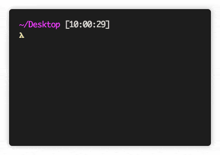

# mdtable-cli
Command line tool for generating markdown tables from CSV-formatted data.



See also the [Crates.io](https://crates.io/crates/mdtable-cli) page.

# Usage
The program expects each row of the table as rows in the input, i.e rows separated by newlines. Each element is separated by a `,` (or another value see flag `-s`). This can either come from a file or from stdin. If from stdin you can signal the end of the table by either `EOF` or by an empty line (i.e hitting enter twice).

Here are some example cli usages:

```
mdtable
mdtable table.csv -o mdtable.md
mdtable table.csv > mdtable.md
cat table.csv | mdtable > mdtable.md
```

See `Options` for a full description of the program arguments.

For examples of input and corresponding output see [examples.md](./examples.md)

# Installation
If you're a rust programmer, e.g you have `cargo` installed, simply do:

```
cargo install mdtable-cli
```

If you don't want to download `rustc` and `cargo` you can download the binary directly from [the releases page](https://github.com/AxlLind/mdtable-cli/releases). Put it in a folder in your path, for example `/usr/local/bin`.

## Building from source
If you don't trust random binaries from github you can build it yourself from source:

```
git clone git@github.com:AxlLind/mdtable-cli.git
cd mdtable-cli
cargo build --release
cp target/release/mdtable /usr/local/bin/
```

# Options
```
USAGE:
    mdtable [FLAGS] [OPTIONS] [FILE]

FLAGS:
    -h, --help        Prints help information
    -m, --minimize    Minimizes table output
    -V, --version     Prints version information

OPTIONS:
    -o, --out <FILE>            Prints output to this.  [default: stdout]
    -s, --separator <STRING>    Separates values.       [default: ,]

ARGS:
    <FILE>    Reads table tables from this. [default: stdin]
```
